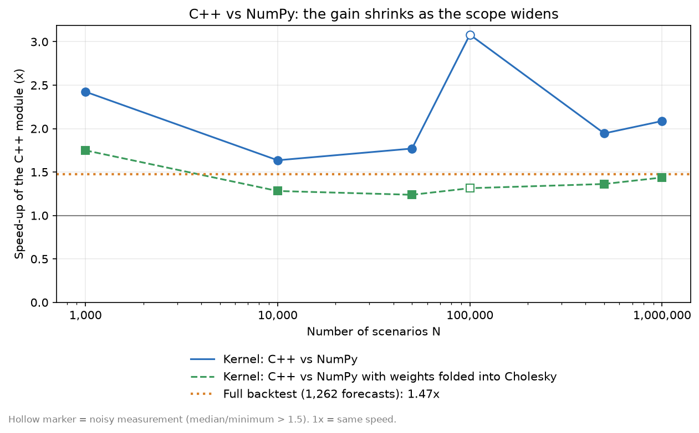

# VaR & Expected Shortfall: a Backtested Multi-Method Risk Engine

A Value at Risk (VaR) and Expected Shortfall (ES) engine for a multi-asset portfolio, validated by an out-of-sample backtest: 4,530 daily forecasts per method, from 2007 to 2025. Three methods are compared (historical simulation, Gaussian parametric, Gaussian Monte Carlo) and tested with Kupiec, Christoffersen and the Basel traffic light. The Monte Carlo core is written in C++ and exposed to Python with pybind11.


## Results

Rolling window of 500 days, 4,530 out-of-sample forecasts per method (2007-12-31 to 2025-12-31), equally weighted portfolio of 5 ETFs (SPY, EEM, IEF, GLD, FXE), 1-day horizon.

**99% VaR (expected: 45.3 violations, 1.00%)**

| Method | Violations | Rate | Kupiec p (frequency) | Christoffersen p (independence) | Basel zone, last 250 days | Share of rolling 250-day windows in yellow / red |
|---|---:|---:|---:|---:|:---:|:---:|
| Historical | 55 | 1.21% | 0.16 | 4.8e-4 | Green | 4.1% / 9.6% |
| Parametric (Gaussian) | 87 | 1.92% | 3.3e-8 | 6.2e-8 | Green | 16.8% / 16.3% |
| Monte Carlo (Gaussian) | 86 | 1.90% | 6.4e-8 | 4.7e-8 | Green | 16.4% / 16.3% |

**Violation rate by confidence level**

| Method | 95% (expected 5%) | 97.5% (expected 2.5%) | 99% (expected 1%) |
|---|---:|---:|---:|
| Historical | 5.03% | 2.65% | 1.21% |
| Parametric | 4.86% | 3.02% | 1.92% |
| Monte Carlo | 4.79% | 3.02% | 1.90% |

**Conclusions**

- **The Gaussian assumption fails in the tail.** The two Gaussian methods are violated almost twice as often as expected at 99%, and the Kupiec test rejects them (p < 1e-7). Near the centre (95%) they are fine, so the cost of normality shows up exactly where VaR is used.
- **Historical simulation passes the frequency test** (55 violations for 45 expected, p = 0.16). This is the absence of evidence against it, not proof that it is right: the test has limited power at this sample size.
- **No method passes the independence test, at any level** (p < 5e-4 in all nine cases). Violations come in clusters: after a violation, the probability of another one the next day is 9.1% (historical) and 13.8% (parametric) at 99%, against about 1% to 2% after a calm day. All three models assume constant volatility.
- **Two failure modes.** In ordinary years the Gaussian methods violate two to three times more than the historical one (fat tails). In 2008 and 2020 all methods fail together (volatility regime change). The historical VaR also has a "ghost effect": it fell 26% in a single day on 2022-03-03, only because the March 2020 crash left the 500-day window.
- **The empirical tail is fatter than Gaussian**: the average ES/VaR ratio at 99% is 1.34 for historical simulation (rolling windows) against 1.15 under a Gaussian model.

Details, figure-by-figure readings and the full test table: [docs/methodology.md](docs/methodology.md).


## Performance

The Monte Carlo scenario generator exists in two interchangeable versions (`backend="python"` with NumPy, `backend="cpp"` with the compiled module). They share the same model; because they use different random number generators, they are validated statistically (20 seeds, agreement within 1%, and convergence to the closed-form Gaussian VaR), not bit for bit.

Measured on an Intel Core i7-1185G7 laptop (32 GB, Windows 11, MSVC `/O2`). On a laptop the absolute speed drifts by about 2x between runs, so only **ratios between implementations timed back to back** are reported.

| Scope | C++ speed-up |
|---|---:|
| Scenario generation vs NumPy (50,000 scenarios or more) | about 2x |
| Scenario generation vs NumPy with weights folded into the Cholesky factor | about 1.4x |
| `monte_carlo_var_es` call (50,000 scenarios or more) | about 1.9x |
| Full rolling backtest (50,000 scenarios per forecast) | about 1.5x (1.47x to 1.59x across runs) |



Where the gain comes from, at 1,000,000 scenarios: folding the portfolio weights into the Cholesky factor (so the N x 5 matrix of simulated returns is never built) already makes NumPy 1.45x faster; the C++ version, which fuses sampling and aggregation in one loop, is another 1.44x faster. Part of that second factor may come from the faster random generator (ziggurat on xoshiro256++, chosen after profiling showed `std::normal_distribution` was slower than NumPy's own sampler).

The gain shrinks as the scope widens: only the simulation is accelerated, while pandas estimation, quantiles and the other two methods are unchanged. Reproduce with `python scripts/benchmark_cpp.py`.

## Methodology

- **Out-of-sample protocol**: for each day `i`, models are estimated on the 500 days strictly before `i` and forecast the VaR and ES of day `i`. A unit test checks that a shock on the last day changes no forecast (no look-ahead bias).
- **Historical simulation**: empirical quantile and tail mean of the P&L over the window.
- **Parametric**: closed-form Gaussian VaR and ES from the estimated mean and covariance matrix.
- **Monte Carlo**: 50,000 scenarios of correlated Gaussian returns (Cholesky decomposition of the covariance matrix), reduced on the fly to portfolio P&L.
- **Validation**: Kupiec proportion-of-failures test, Christoffersen independence and conditional coverage tests, Basel traffic light on 250-day windows.
- **Conventions**: P&L is signed (a loss is negative), VaR and ES are positive numbers expressing a loss, a violation is a day where `pnl < -VaR`.

## Project structure

```
var-es-risk-engine/
├── src/riskengine/
│   ├── portfolio.py        # data loading, log-returns, portfolio P&L
│   ├── measures.py         # historical, parametric and Monte Carlo VaR/ES
│   ├── backtest.py         # rolling-window backtest, violation counts
│   ├── tests_stat.py       # Kupiec, Christoffersen, Basel traffic light
│   └── plotting.py         # report figures
├── cpp/
│   ├── mc_engine.cpp       # C++ Monte Carlo engine (pybind11)
│   └── setup.py            # build script (MSVC, g++, clang)
├── scripts/                # download_data, build_pnl, run_backtest, run_stat_tests,
│                           # make_figures, compare_backends, benchmark_cpp, plot_benchmark
├── tests/                  # pytest suite (36 tests)
├── results/                # backtest, statistical tests and benchmark tables (CSV)
├── figures/                # figures used in this README and in docs/
└── docs/                   # methodology and project journal
```

## Installation

Python 3.10 or later. From the project root:

```powershell
# Windows (PowerShell)
python -m venv .venv
.\.venv\Scripts\Activate.ps1
python -m pip install -e . pytest
```

```bash
# Linux / macOS
python -m venv .venv
source .venv/bin/activate
python -m pip install -e . pytest
```

The C++ module is optional: without it the project runs entirely in Python and the C++ tests are skipped. To build it you need a C++17 compiler (Visual Studio Build Tools on Windows, g++ or clang elsewhere):

```
python -m pip install pybind11 setuptools
cd cpp
python setup.py build_ext --build-lib ../src
cd ..
```

Run the tests with `python -m pytest`.

## Usage

Reproduce the whole analysis (prices are downloaded with `yfinance`, so re-downloading may give slightly different adjusted prices than the ones used for the committed results):

```
python scripts/download_data.py
python scripts/build_pnl.py
python scripts/run_backtest.py                       # Python backend
python scripts/run_backtest.py --backend cpp         # C++ backend
python scripts/compare_backends.py
python scripts/run_stat_tests.py
python scripts/make_figures.py
python scripts/benchmark_cpp.py
python scripts/plot_benchmark.py
```

Use the library directly:

```python
import numpy as np
from riskengine.portfolio import (
    DEFAULT_WEIGHTS, compute_log_returns, load_prices, portfolio_pnl)
from riskengine.measures import (
    historical_var_es, parametric_var_es, monte_carlo_var_es)

returns = compute_log_returns(load_prices())[list(DEFAULT_WEIGHTS)]
pnl = portfolio_pnl(returns)
weights = np.array(list(DEFAULT_WEIGHTS.values()))

window = returns.iloc[-500:]                      # the last 500 days
historical_var_es(pnl.iloc[-500:], alpha=0.99)    # (var, es), positive losses
parametric_var_es(window, weights, alpha=0.99)
monte_carlo_var_es(window, weights, alpha=0.99, n_sims=50_000, backend="cpp")
```

## Known limitations and roadmap

**Limitations**

- **Constant volatility.** None of the three models has conditional volatility, which explains the clustering of violations (independence test rejected everywhere).
- **Gaussian assumption** for two of the three methods, rejected by the data in the tail. The Monte Carlo method uses the same Gaussian model as the parametric one: it validates the code and carries the C++ engine, but adds no statistical information here.
- **Only the VaR is backtested, not the ES.** The ES is not elicitable; Acerbi-Szekely tests are a natural extension.
- **Two crises (2008, 2020) hold 25 of the 55 historical violations**, so conclusions rest on few independent episodes. 27 tests are run: the strongest rejections (p < 1e-6) survive a Bonferroni correction, the borderline 97.5% Kupiec rejection (p = 0.029) does not.
- **Stylised portfolio**: fixed equal weights with daily rebalancing, no allocation optimisation, linear instruments only (no derivatives). Portfolio P&L is aggregated from log-returns, which slightly approximates simple returns. The ETFs are USD-quoted and no FX conversion is applied, so the 1,000,000 portfolio value is in nominal units.
- **Fixed window of 500 days**, no sensitivity analysis (250, 1,000).
- **Backtest speed**: the three confidence levels re-simulate the same scenarios (same seed) for each date. Simulating once per date and reusing the scenarios would save two simulations out of three in both backends; it is not done yet.
- **C++ backend**: statistically validated, not bit-identical to the Python backend; benchmark ratios come from one laptop.

**Roadmap (v2)**

- GARCH volatility with Filtered Historical Simulation, to address the clustering.
- Extreme Value Theory for the tail, and copulas for the dependence structure.
- Expected Shortfall backtest (Acerbi-Szekely).
- Window-length sensitivity analysis.
- Single simulation per date, and a multithreaded C++ engine (release the GIL).
- Interactive dashboard.

## References

- Jorion, P. (2007). *Value at Risk: The New Benchmark for Managing Financial Risk*, 3rd ed. McGraw-Hill.
- Kupiec, P. (1995). Techniques for verifying the accuracy of risk measurement models. *Journal of Derivatives*, 3(2), 73-84.
- Christoffersen, P. (1998). Evaluating interval forecasts. *International Economic Review*, 39(4), 841-862.
- Acerbi, C. and Szekely, B. (2014). Backtesting Expected Shortfall. *Risk Magazine*, December 2014.
- Basel Committee on Banking Supervision (1996). *Supervisory framework for the use of "backtesting" in conjunction with the internal models approach to market risk capital requirements*.
- Basel Committee on Banking Supervision (2019). *Minimum capital requirements for market risk* (Fundamental Review of the Trading Book).
- Marsaglia, G. and Tsang, W. W. (2000). The Ziggurat method for generating random variables. *Journal of Statistical Software*, 5(8).
- Blackman, D. and Vigna, S. (2021). Scrambled linear pseudorandom number generators. *ACM Transactions on Mathematical Software*, 47(4).