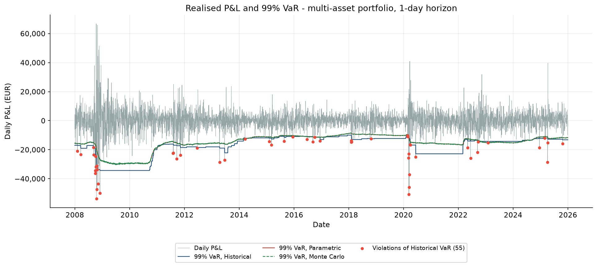
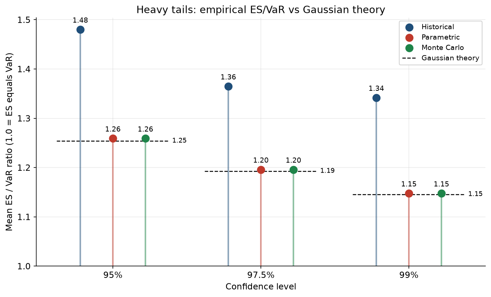
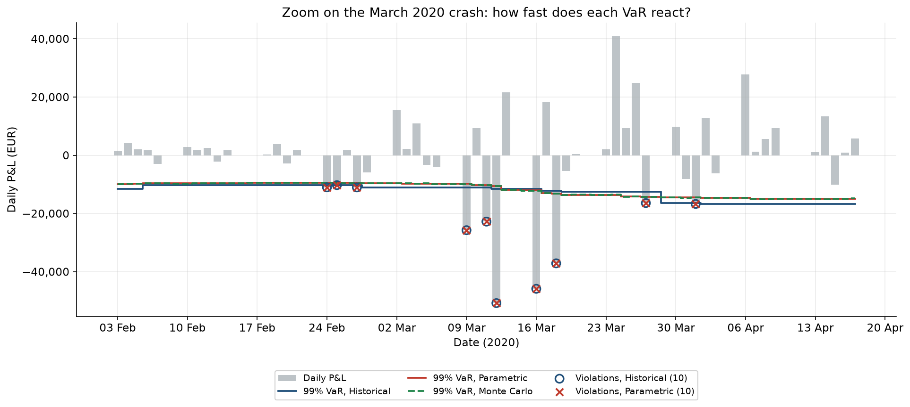
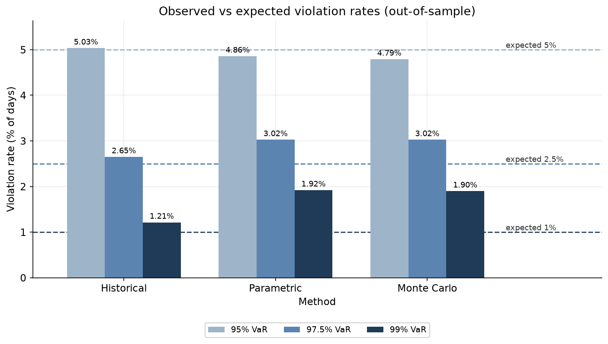

# Methodology and reading of the results

## 1. Summary

- Three one-day VaR/ES methods (historical simulation, Gaussian parametric, Gaussian Monte Carlo) are compared on a 5-asset portfolio, out of sample, on 4,530 daily forecasts (2007-12-31 to 2025-12-31).
- At 99%, the two Gaussian methods are violated almost twice as often as expected (1.9% instead of 1.0%); the Kupiec test rejects them (p < 1e-7). Historical simulation is statistically acceptable on frequency (1.21%, p = 0.16).
- No method passes the independence test at any level (p < 5e-4 everywhere): violations cluster in crises, because all three models assume constant volatility.
- The empirical ES/VaR ratio is above the Gaussian value at every level (1.34 vs 1.15 at 99% for rolling-window forecasts, 1.53 on the full sample), which is a direct measure of fat tails.
- Natural next step: conditional volatility (GARCH, Filtered Historical Simulation).

## 2. Setup

- **Data**: daily adjusted closes of five USD-listed ETFs (SPY, EEM, IEF, GLD, FXE), 2006-01-04 to 2025-12-31 (5,030 daily returns). Descriptive statistics of the portfolio P&L: annualised volatility 10.86%, skewness -0.01, excess kurtosis 10.69.
- **Portfolio**: equally weighted (20% each), value 1,000,000, rebalanced daily, 1-day horizon. Daily P&L = V0 x sum(w_i x r_i) with log-returns.
- **Out-of-sample protocol**: for each day i, models are estimated on the 500 days strictly before i (`returns.iloc[i - window:i]`, which excludes day i) and forecast the VaR/ES of day i. No future information is used; a unit test checks it (a shock on the last day changes no forecast).
- **Methods**: historical simulation (empirical quantile and tail mean), parametric (closed-form Gaussian VaR and ES), Monte Carlo (50,000 scenarios, Cholesky decomposition of the covariance matrix).
- **Levels**: 95%, 97.5%, 99%. A violation is a day where the loss exceeds the VaR.
- **Validation**: Kupiec (frequency), Christoffersen (independence), joint conditional coverage, Basel traffic light.

## 3. Reading the figures

### Figure 1 - P&L and 99% VaR



The VaR is drawn as a negative number so it can be compared directly with the signed daily P&L; each red dot is a day where the loss exceeded the historical VaR (55 over 4,530 days). Violations are concentrated in a handful of episodes: 2008 and 2020 alone hold 25 of the 55. The historical VaR is a staircase (flat most days, then jumps) while the parametric and Monte Carlo VaR move continuously.

The level of the VaR depends heavily on the window content. The historical 99% VaR is 9,951 in January 2018 (calm period) and 34,313 in June 2009 and June 2010 (frozen at the same value for a year, because the 2008 losses stay in the 500-day window): a factor of 3.4. It falls to 19,963 by the end of 2010, when the crisis leaves the window. After March 2020, the historical VaR is flat at 22,819 from December 2020 at the latest until 2 March 2022, while the parametric VaR is 15,324 in December 2020 and 16,415 in December 2021: the historical VaR is 49% and 39% above it, because the 99% quantile of a 500-day window (about the 5th worst day) is pinned by the March 2020 losses until they leave the window.

### The ghost effect

On 3 March 2022 the historical 99% VaR falls from 22,819 to 16,801 in a single day (-26.4%, the largest one-day drop of the whole sample). The date matches the exit of the 9 March 2020 loss (-25,746) from the 500-day window: 501 trading days separate the two dates. The VaR keeps falling as the other crash days leave, reaching 14,151 on 14 March 2022 (-38% in eight trading days), although nothing changed in the market. This is the ghost effect: the VaR depends on when an old event enters and leaves the estimation window, not only on current risk.

### Figure 2 - ES/VaR ratio



The parametric and Monte Carlo ratios match the Gaussian theory (1.26, 1.20, 1.15), which confirms the implementation. The historical ratio is above it at every level (1.48, 1.36, 1.34): beyond the VaR, the average loss is 34% larger than the VaR at 99%, against 15% under a Gaussian model. These are averages of daily rolling-window ratios; on the full 20-year sample the 99% ratio is 1.53. The rolling figure is lower, plausibly because windows without a crisis have thinner tails and the 99% tail mean rests on only about 5 points per window (not tested here).

### Figure 3 - Zoom on March 2020



The historical and parametric VaR are violated on exactly the same 10 days between 24 February and 1 April; neither anticipates the crash. On 19 February the 99% VaR is 10,236 (historical) and 9,497 (parametric); on 12 March the loss is 50,793, about 4.4 times the historical VaR of that day. Three violations occur between 9 and 12 March while neither VaR has moved by more than 7%. By 30 March the VaR has risen by about 60% (historical) and 50% (parametric), while single-day losses had reached four to five times the pre-crash VaR.

The two methods do not react in the same way. The parametric VaR leads from 13 to 27 March (11,876 vs 11,557 on 13 March), because volatility reacts to squared extremes, while the historical quantile waits for several extremes to accumulate; the historical VaR then jumps above it again on 30 March (16,491 vs 14,459). Both are late.

### Figure 4 - Violation rates



At 95% all three methods are close to the expected rate (5.03%, 4.86%, 4.79%). At 97.5% the Gaussian methods are above (3.02% vs 2.5%). At 99% the Gaussian methods violate 1.9% of days, almost twice the expected 1.0%, while historical simulation is closer (1.21%). The Gaussian assumption therefore costs little near the centre and a lot in the tail, which is where VaR is used.

Violations per year show two distinct failure modes. In ordinary years the Gaussian methods violate two to three times more than the historical one (2011: 11 vs 4; 2018: 11 vs 4; 2022: 7 vs 4): this is the normality problem (fat tails outside crises). In 2008 and 2020 all methods fail together (historical: 14 and 11; Gaussian: 23 and 12): this is a volatility-regime problem. The historical method also has no violation at all in 2009, 2010, 2017, 2019 and 2021: a long window is too low when a crisis begins and too high long after it ends.

## 4. Statistical validation

| Method | Level | Violations (expected) | Rate | Kupiec p | Independence p | Cond. coverage p |
|---|---|---|---|---|---|---|
| Historical | 95% | 228 (226.5) | 5.03% | 0.919 | 9.9e-7 | 6.3e-6 |
| Historical | 97.5% | 120 (113.3) | 2.65% | 0.525 | 2.8e-6 | 1.4e-5 |
| Historical | 99% | 55 (45.3) | 1.21% | 0.161 | 4.8e-4 | 8.5e-4 |
| Parametric | 95% | 220 (226.5) | 4.86% | 0.656 | 2.3e-6 | 1.3e-5 |
| Parametric | 97.5% | 137 (113.3) | 3.02% | 0.029 | 1.1e-7 | 6.8e-8 |
| Parametric | 99% | 87 (45.3) | 1.92% | 3.3e-8 | 6.2e-8 | 1.0e-13 |
| Monte Carlo | 95% | 217 (226.5) | 4.79% | 0.514 | 1.3e-6 | 6.6e-6 |
| Monte Carlo | 97.5% | 137 (113.3) | 3.02% | 0.029 | 1.1e-7 | 6.8e-8 |
| Monte Carlo | 99% | 86 (45.3) | 1.90% | 6.4e-8 | 4.7e-8 | 1.5e-13 |

- **Frequency**: only the Gaussian methods at 99% are clearly rejected; at 97.5% the rejection is borderline (p = 0.029). A high p-value is not proof that a model is correct, only the absence of evidence against it: with 55 violations for 45 expected, the historical model at 99% is not rejected, but the test has limited power.
- **Independence**: rejected in all nine cases. At 99% the probability of a violation the day after a violation is 9.1% (historical) and 13.8% (parametric), against 1.1% and 1.7% after a calm day: violations come in clusters, even at 95% where the frequency is nearly perfect.
- **Basel traffic light (99%, 250-day windows)**: all three methods are green on the last window (4 violations), but over all rolling windows the historical model is red 9.6% of the time (worst window: 14 violations) and the Gaussian models 16.3% (worst: 23). These shares are descriptive: the windows overlap.

## 5. Limits

- The three models have constant volatility, hence the clustering. Remedy: GARCH(1,1) and Filtered Historical Simulation.
- The Monte Carlo method uses the same Gaussian model as the parametric one: it validates the code but adds no information here.
- Window length (500 days) is fixed; no sensitivity analysis (250, 1,000).
- Only the VaR is backtested, not the ES (not elicitable; Acerbi-Szekely tests are a natural extension).
- Two crises dominate the sample (25 of 55 historical violations).
- 27 tests are run (9 method-level pairs, 3 tests each); the strongest rejections (p < 1e-6) survive a Bonferroni correction, the 97.5% Kupiec rejection does not.
- Stylised portfolio: equal weights, daily rebalancing, 1-day horizon, linear instruments. P&L is in a nominal currency unit labelled EUR, although the ETFs are USD-quoted and no FX conversion is applied.

## 6. Reproducibility and performance

```powershell
python scripts/download_data.py
python scripts/build_pnl.py
python scripts/run_backtest.py
python scripts/run_stat_tests.py
python scripts/make_figures.py
python -m pytest
```

Python baseline: the full backtest (4,530 forecasts x 3 methods x 3 levels, 50,000 scenarios) runs in 70 seconds. To be updated after the C++ Monte Carlo module.